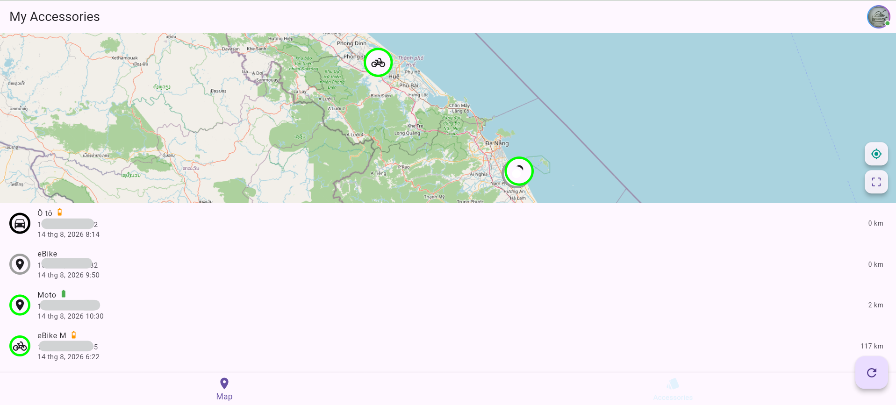
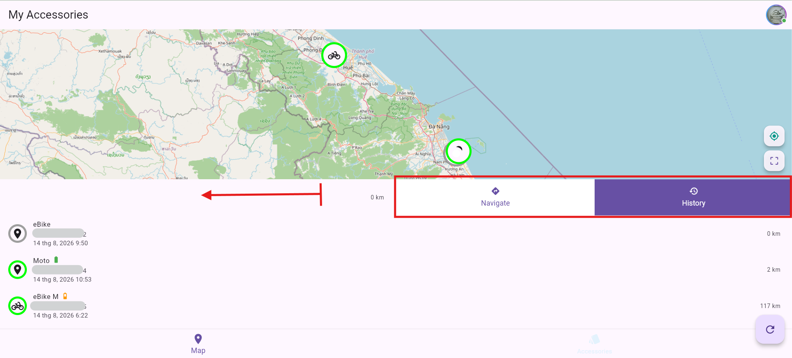
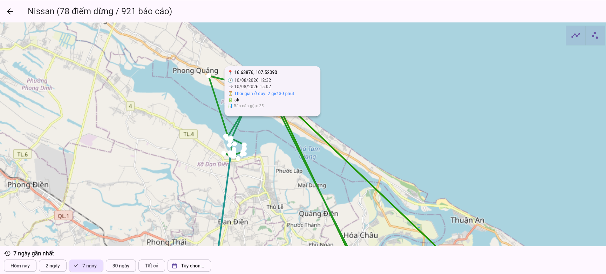
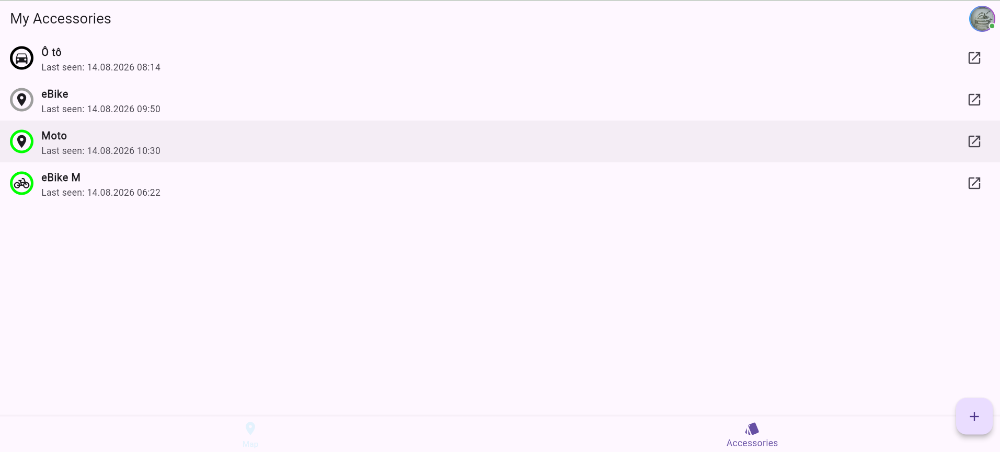
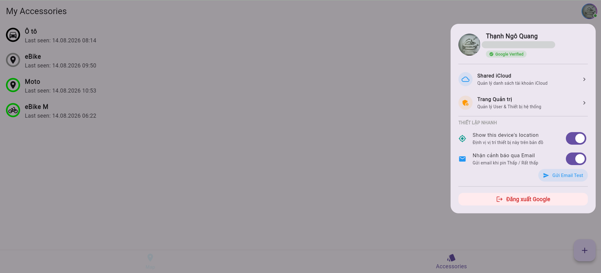
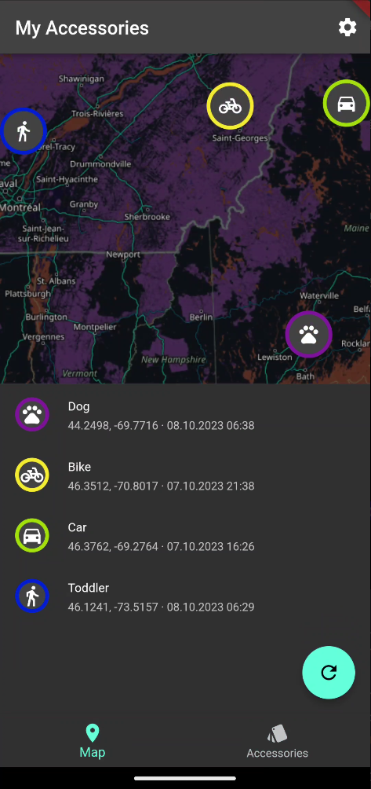
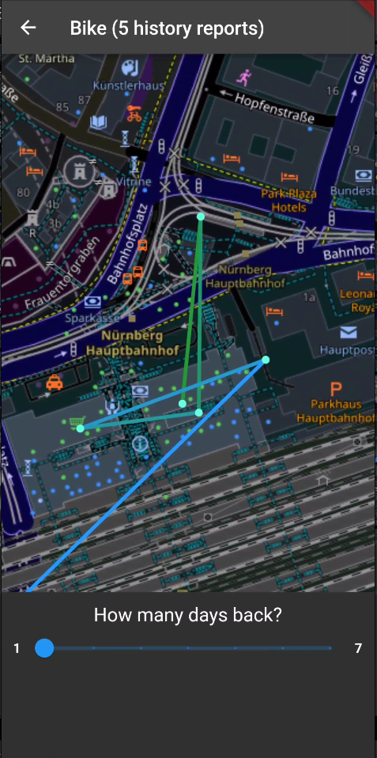
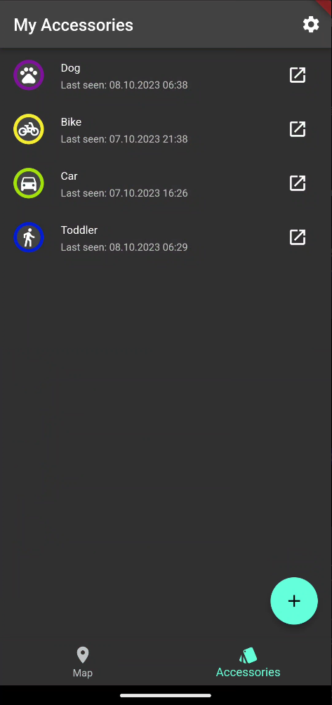
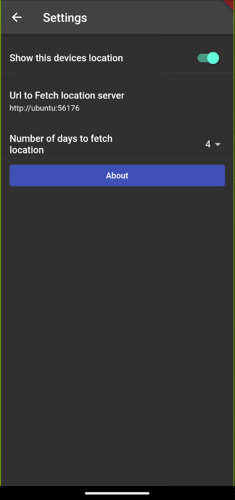

# FindMy Server (v2.0.2)

Hệ thống máy chủ tự triển khai (**Self-hosted**) cho mạng lưới **Apple Find My**, được đóng gói trọn gói bằng Docker (hỗ trợ cả **x86_64 / amd64** và **ARM64 / Raspberry Pi / Apple Silicon**). Hỗ trợ theo dõi vị trí các thiết bị OpenHaystack / AirTag tự chế (ESP32, NRF5x, ST17H66...) 24/7 một cách an toàn, bảo mật với tính năng đăng nhập Google OAuth, hồ chứa iCloud dùng chung, vùng an toàn (Geofence) và thông báo đa kênh.



---

## 📸 Screenshots

<details>
<summary><b>🌐 Giao diện Web (Desktop) - cập nhật sau</b></summary>
<br>

| Dashboard & Thao tác nhanh | Lịch sử di chuyển |
| :---: | :---: |
|  |  |

| Quản lý thiết bị (Accessories) | Cấu hình thông báo & Hệ thống |
| :---: | :---: |
|  |  |

</details>

<details>
<summary><b>📱 Giao diện Di Động (Mobile Responsive) - Cập nhật sau</b></summary>
<br>

| Dashboard Mobile | Lịch sử Mobile | Quản lý thiết bị | Cấu hình Mobile |
| :---: | :---: | :---: | :---: |
|  |  |  |  |

</details>

---

## 🌟 Tính Năng Nổi Bật

- 👥 **Hồ Chứa iCloud Dùng Chung (Shared iCloud Pool)**:
  - Thêm nhiều tài khoản Apple ID để tự động xoay vòng truy vấn vị trí, tránh bị giới hạn tần suất (rate-limit) từ Apple.
  - Hỗ trợ xác thực 2FA trực tiếp trên giao diện Web (qua Thiết bị tin cậy hoặc mã SMS).
  - Tự động theo dõi trạng thái hoạt động / hết hạn phiên của từng tài khoản Apple ID.

- 🛡️ **Vùng An Toàn & Cảnh Báo Ra/Vào (Geofencing / Safe Zones)**:
  - Thiết lập không giới hạn các khu vực an toàn (Nhà riêng, Cơ quan, Trường học, Bãi đỗ xe...) với bán kính tùy chỉnh trực quan trên bản đồ.
  - Tùy chọn sự kiện cảnh báo linh hoạt: Khi thẻ **Đi vào**, **Rời khỏi** hoặc **Cả hai**.
  - Gán thẻ định vị vào từng vùng an toàn cụ thể để nhận thông báo tức thì khi vị trí thay đổi.

- 🔔 **Thông Báo & Cảnh Báo Đa Kênh (Telegram, Discord, Webhook, Email)**:
  - **Cảnh báo ra/vào Vùng An Toàn**: Thông báo ngay lập tức khi thiết bị rời khỏi hoặc đi vào khu vực giám sát kèm toạ độ và liên kết mở nhanh Google Maps.
  - **Cảnh báo pin yếu & pin khẩn cấp**: Tự động giải mã trạng thái pin từ các bản tin của mạng Apple Find My và phân loại thành **4 mức**:
    | Mức mã hóa (Bit) | Trạng thái | Tỷ lệ pin ước tính | Mức độ cảnh báo |
    | :---: | :--- | :--- | :--- |
    | `00` | 🟢 **Đầy / Tốt (`ok`)** | ~75% – 100% | Bình thường |
    | `01` | 🟡 **Trung bình (`medium`)** | ~25% – 75% | Bình thường |
    | `10` | 🟠 **Yếu (`low`)** | ~10% – 25% | ⚠️ **Cảnh báo pin yếu** |
    | `11` | 🔴 **Rất yếu / Sắp cạn (`criticalLow`)** | < 10% | 🚨 **Cảnh báo khẩn cấp** |
  - **Cảnh báo tài khoản iCloud**: Tự động cảnh báo khi tài khoản Apple ID bị hết hạn phiên đăng nhập hoặc yêu cầu xác thực lại (2FA).
  - **Kênh hỗ trợ**: **Telegram Bot**, **Discord Webhook**, **Custom Webhook (Zalo OA / n8n / Home Assistant / Node-RED)**, **Email (SMTP)**.
  - > 💡 **Cơ chế chống spam thông minh:** Cảnh báo chỉ được gửi 1 lần khi trạng thái thay đổi. Có nút **Test Send** trực tiếp trong cài đặt để kiểm tra kết nối từng kênh.

- 🤝 **Chia Sẻ Thẻ Định Vị (Tag Sharing)**:
  - Chia sẻ quyền theo dõi thẻ cho người dùng khác trong hệ thống thông qua địa chỉ Email.
  - Người được chia sẻ có thể xem vị trí thời gian thực và lịch sử di chuyển mà không làm ảnh hưởng đến cấu hình gốc của thiết bị.

- 🎨 **Tùy Biến Thẻ & Biểu Tượng Đa Dạng**:
  - Đổi tên thẻ trực tiếp, tuỳ chọn kho biểu tượng phong phú (Xe hơi, Xe máy, Thú cưng, Balo, Chìa khóa, Trẻ em, Thiết bị...) cùng bảng màu đa dạng giúp phân biệt trực quan trên bản đồ.

- 🔒 **Đăng Nhập Google OAuth & Phân Quyền (RBAC)**:
  - Đăng nhập bảo mật bằng tài khoản Google.
  - Phân quyền rõ ràng giữa **Admin** (quản lý toàn bộ hệ thống, iCloud pool, người dùng) và **User** (quản lý thiết bị cá nhân).

- ⚡ **Tự Động Đồng Bộ Vị Trí 24/7**:
  - Máy chủ tự động đồng bộ ngầm và lưu trữ vị trí định kỳ vào cơ sở dữ liệu mà không cần giữ trình duyệt mở.

- 🗺️ **Lịch Sử Di Chuyển Thông Minh**:
  - Tự động gom các vị trí lân cận thành điểm dừng chân và hiển thị thời gian lưu trú cụ thể.
  - Kích thước điểm dừng mở rộng tương ứng theo thời gian lưu trú.
  - Hỗ trợ xem lại lộ trình theo từng khoảng thời gian tùy chọn.

- 📦 **Tất Cả Trong Một (All-in-One Docker)**:
  - Giao diện Web (Flutter) và Backend API (FastAPI) được đóng gói chung vào một container duy nhất (Port `6176`), tương thích kiến trúc `amd64` và `arm64`.

---

## 🚀 Khởi Chạy Nhanh Với Docker Compose

### 1. Tạo file `.env`

Tạo file `.env` trong thư mục dự án với nội dung mẫu:

```env
# Google OAuth 2.0 (Bắt buộc để xác thực người dùng)
# Hướng dẫn tạo Client ID: https://developers.google.com/identity/protocols/oauth2/web-server?hl=vi
GOOGLE_CLIENT_ID=your-client-id.apps.googleusercontent.com

# Chu kỳ tự động lấy vị trí từ Apple (phút) - Khuyến nghị từ 15 đến 60 phút
SYNC_INTERVAL_MINUTES=30

# Danh sách email Admin hệ thống (cách nhau bởi dấu phẩy)
ADMIN_EMAILS=admin@example.com

# Chuỗi bí mật JWT (Hãy thay đổi thành chuỗi ngẫu nhiên dài và bảo mật)
JWT_SECRET=your-super-secret-jwt-key-here-change-in-production

# Bật/tắt log debug chi tiết (true/false)
DEBUG_LOGS=false

# (Tùy chọn) Cấu hình máy chủ SMTP để gửi Email cảnh báo
SMTP_HOST=smtp.gmail.com
SMTP_PORT=587
SMTP_USER=your-email@gmail.com
SMTP_PASS=your-app-password
SMTP_FROM=FindMy Server <your-email@gmail.com>
```

---

### 2. Tạo file `docker-compose.yml`

```yaml
services:
  anisette:
    image: dadoum/anisette-v3-server:latest
    container_name: findmy-anisette
    restart: unless-stopped
    #ports:
    #  - "6969:6969"
    volumes:
      - anisette_data:/home/Alcoholic/.config/anisette-v3
    logging:
      driver: "json-file"
      options:
        max-size: "10m"
        max-file: "3"

  findmy-server:
    image: tnq22/findmy-server:latest
    container_name: findmy-server
    restart: unless-stopped
    ports:
      - "6176:6176"
    environment:
      - ANISETTE_SERVER_URL=http://anisette:6969
      - GOOGLE_CLIENT_ID=${GOOGLE_CLIENT_ID}
      - JWT_SECRET=${JWT_SECRET:-super-secret-findmy-key-change-in-production}
      - SYNC_INTERVAL_MINUTES=${SYNC_INTERVAL_MINUTES:-60}
      - DEBUG_LOGS=${DEBUG_LOGS:-false}
      - SMTP_HOST=${SMTP_HOST}
      - SMTP_PORT=${SMTP_PORT:-587}
      - SMTP_USER=${SMTP_USER}
      - SMTP_PASS=${SMTP_PASS}
      - SMTP_FROM=${SMTP_FROM}
      - ADMIN_EMAILS=${ADMIN_EMAILS}
    volumes:
      - ./database:/app/data
    logging:
      driver: "json-file"
      options:
        max-size: "10m"
        max-file: "3"
    depends_on:
      - anisette

volumes:
  anisette_data:
```

---

### 3. Khởi Chạy Ứng Dụng

Chạy lệnh sau để tải container và khởi chạy ngầm:

```bash
docker compose up -d
```

Sau khi khởi chạy thành công:
- 🌐 **Giao diện Web**: [http://localhost:6176](http://localhost:6176)
- 📖 **API Docs (Swagger UI)**: [http://localhost:6176/docs](http://localhost:6176/docs)

---

### 4. Cập Nhật Lên Phiên Bản Mới

Để cập nhật máy chủ lên phiên bản mới nhất từ Docker Hub:

```bash
docker compose pull
docker compose up -d
```

---

## 🔔 Hướng Dẫn Cấu Hình Kênh Cảnh Báo

Mỗi người dùng có thể cấu hình kênh thông báo riêng tại mục **Cài đặt thông báo (Notification Settings)** trên thanh điều hướng:

1. **Telegram Bot**:
   - Tạo bot mới qua [@BotFather](https://t.me/BotFather) để lấy `Bot Token`.
   - Lấy `Chat ID` cá nhân hoặc nhóm qua [@userinfobot](https://t.me/userinfobot) hoặc [@getidsbot](https://t.me/getidsbot).
   - Nhập `Token` và `Chat ID` vào cài đặt, sau đó bấm **Thử nghiệm (Test)**.

2. **Discord Webhook**:
   - Vào kênh Discord của bạn > **Chỉnh sửa kênh (Edit Channel)** > **Tích hợp (Integrations)** > **Tạo Webhook (Webhooks)** > Sao chép URL Webhook.
   - Dán URL vào mục cấu hình Discord.

3. **Custom Webhook (Zalo OA / n8n / Home Assistant)**:
   - Cung cấp URL webhook (POST JSON). FindMy Server sẽ tự động đẩy payload dữ liệu sự kiện (`low_battery`, `geofence_alert`, `icloud_status`) để bạn dễ dàng tích hợp vào luồng tự động hóa Zalo OA, Home Assistant automation hoặc n8n.

4. **Email (SMTP)**:
   - Cấu hình SMTP trong file `.env` của máy chủ.
   - Người dùng bật nhận thông báo qua Email để nhận email báo cáo trạng thái pin và vùng an toàn.

---

## 🛠️ Cài Đặt Thẻ Định Vị (Hardware Tag)

1. Truy cập mục [Releases](https://github.com/dchristl/macless-haystack/releases/latest) để tải xuống script `generate_keys.py` cùng tệp zip firmware phù hợp (ESP32 hoặc NRF5x).

2. Chạy script `generate_keys.py` để tạo cặp khóa định vị. 
Lưu ý: cần có thư viện phụ thuộc `cryptography`. Hãy cài đặt nó bằng lệnh:
   ```bash
   pip install cryptography
   python generate_keys.py
   ```

3. Giải nén firmware và nạp nó vào thiết bị của bạn:
   - Xem hướng dẫn [Cài đặt firmware ESP32](firmware/ESP32/README.md)
   - Xem hướng dẫn [Cài đặt firmware NRF5x](firmware/nrf5x/README.md)

4. Đăng nhập vào giao diện Web FindMy Server và thêm thẻ bằng khóa Base64 (`Advertisement Key`) đã tạo.

> 💡 **Lưu ý:** Bất kỳ thiết bị hoặc firmware nào tương thích với chuẩn OpenHaystack / Apple Find My (như ESP32, nRF51/nRF52, [ST17H66](https://github.com/biemster/FindMy/tree/main/Lenze_ST17H66)...) đều hoạt động tốt với FindMy Server.

---

## 📜 Ghi Nhận (Credits)

Dự án được phát triển và tối ưu hóa dựa trên các mã nguồn mở:
- [OpenHaystack](https://github.com/seemoo-lab/openhaystack)
- [FindMy.py](https://github.com/malmeloo/FindMy.py)
- [Anisette-v3-Server](https://github.com/Dadoum/anisette-v3-server)
- [Macless-Haystack](https://github.com/dchristl/macless-haystack)
